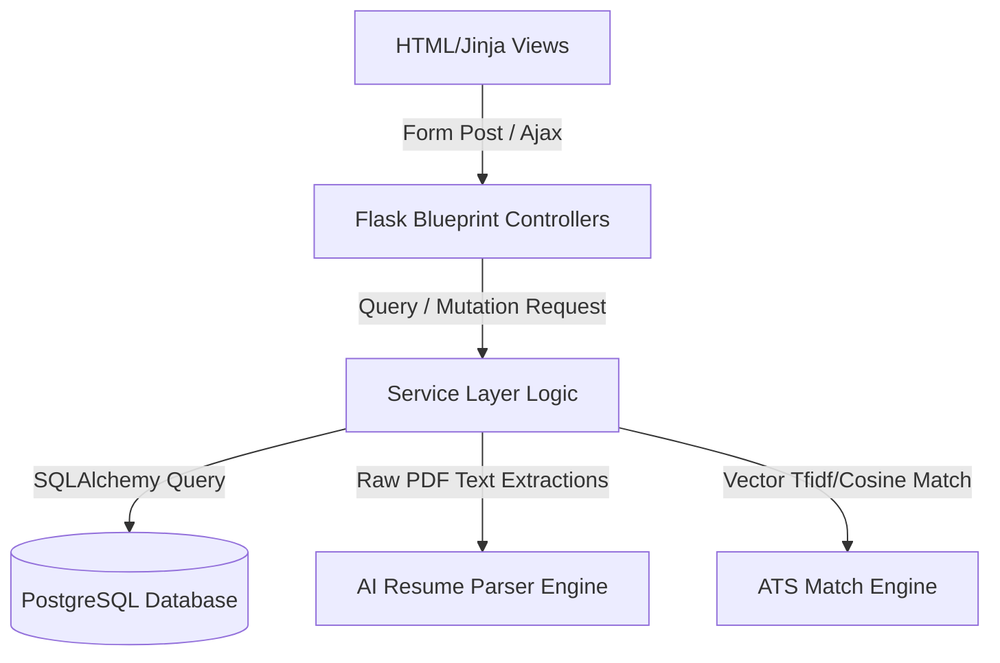

# System Architecture Reference Manual

This manual describes the architecture, frameworks, data flows, and design patterns of the CampusHire AI platform.

---

## 1. Architectural Patterns
The application follows the **Model-View-Controller (MVC)** architectural pattern, structured into a clean **Service Layer** pattern to isolate database transactions from controller routes.

### Key Components:
- **Blueprints (Controllers)**: Group logical routing modules (e.g. `auth_bp`, `student_bp`, `recruiter_bp`, `tpo_bp`, `admin_bp`).
- **Models (Database)**: SQLAlchemy mapping schemas defining tables, columns, indexes, and cascades.
- **Service Layer (Logic)**: Isolated classes (e.g., `AdminService`, `RecruiterService`, `AtsService`, `ResumeParserService`) containing database transactions and business logic.
- **Templates (Views)**: Jinja2 HTML templates utilizing Bootstrap 5, glassmorphism CSS, and responsive styling.

---

## 2. Core Service Engines

### A. Resume Parser Engine
- Extracts text using **pdfplumber** with a fallback to **PyPDF2**.
- Operates rule-based regular expressions and dictionary scans to parse email addresses, phone numbers, social handles, and academic sections.
- Computes matching confidence percentages and flags missing components.
- Serializes extracted parameters as a JSON string to store directly inside the `parsed_text` column on the `resumes` table.

### B. ATS matching Engine
- Uses **scikit-learn**'s `TfidfVectorizer` to convert job descriptions and resume texts into numerical vectors.
- Computes the Cosine Similarity between vectors to extract vocabulary matches.
- Applies weighted scores:
  - **Skills**: 40%
  - **Projects**: 20%
  - **CGPA**: 20%
  - **Certifications**: 10%
  - **Experience**: 10%
- Combines the rule-based score and cosine text similarity into a final score (0-100).
- Generates skill gap analyses, recommendations, match confidence labels, and keyword overlap explanations.

---

## 3. Data Integrity & Security
- **Role-Based Access Control**: Configured through `role_required` decorators restricting endpoints to authorized user roles.
- **CSRF Protection**: Handled by Flask-WTF CSRF validation.
- **Data Locking**: verified students cannot edit academic fields (`cgpa`, `backlogs_count`, `branch_id`, `graduation_year`) in the profile.
- **Audit Logging**: Successful logins, logouts, failed authentication attempts, and data mutations are recorded in the `audit_logs` table.
