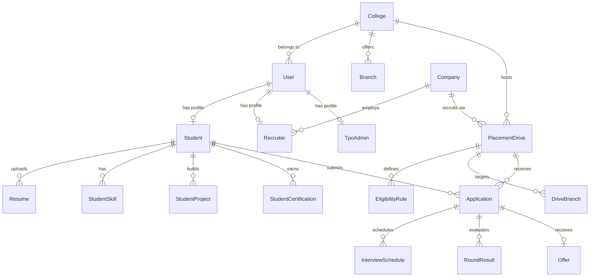

# CampusHire AI — Exhaustive Technical Architecture & System Documentation

---

## 1. Executive Summary & Architecture Overview

CampusHire AI is an enterprise-grade, multi-tenant placement management and Automated Applicant Tracking System (ATS) platform. It automates campus recruitment pipelines for universities, corporate recruiters, Training & Placement Officers (TPOs), and system administrators.

### Core Architectural Principles
1. **Multi-Tenant College Isolation**: Strict separation of university data anchored by `College` entities (`colleges` table), ensuring students, drives, and TPO operations are scoped to their respective institution.
2. **Layered Service Architecture**: Clear separation of concerns dividing Flask view functions (controllers), service layers (`AuthService`, `StudentService`, `AtsService`, `TpoService`, `RecruiterService`, `AdminService`), SQLAlchemy ORM data models, and helper utilities.
3. **Dual-Engine Placement Match System**:
   - **Rule-Based Eligibility Engine**: Validates structural criteria (CGPA cutoffs, max backlogs, degree/branch matching, mandatory skills, batch years, gender constraints).
   - **NLP/TF-IDF ATS Scoring Engine**: Combines structural criteria scoring (75% weight) with TF-IDF cosine similarity text matching (25% weight) using `scikit-learn` to calculate candidate-to-job-description match scores.
4. **Optimized Query Operations**: High-throughput DB operations utilizing SQLAlchemy joined loading (`joinedload`/`selectinload`), scalar subqueries for dashboard stats, and in-memory preloading containers to eliminate N+1 database queries.

---

## 2. Technology Stack & Key Dependencies

### Core Framework & Backend
- **Python 3.13 / Flask 3.0.3**: Lightweight WSGI web framework providing modular routing via Blueprints.
- **SQLAlchemy 2.0.41 / Flask-SQLAlchemy 3.1.1**: Object-Relational Mapper (ORM) handling PostgreSQL database operations, lazy/eager loading strategies, transactions, and migration compatibility.
- **psycopg2-binary 2.9.12**: PostgreSQL database adapter enabling native UUID, CITEXT, and JSONB handling.
- **Werkzeug 3.1.3 & Flask-Bcrypt 1.0.1**: Secure password hashing using adaptive Bcrypt hashing algorithm (`BCRYPT_LOG_ROUNDS=12`).
- **Flask-Login 0.6.3**: User session lifecycle manager, handling authenticated session cookies, `current_user` proxy, and session protection.
- **Flask-WTF 1.2.2 & WTForms 3.2.1**: Server-side form validation, handling input sanitization, type coercion, and CSRF token generation/verification.
- **Gunicorn 23.0.0**: Production WSGI HTTP Server supporting pre-fork worker processes.

### NLP, ATS Engine & Document Processing
- **scikit-learn 1.7.2 & NumPy 2.2.6**: Powers the ATS match engine via `TfidfVectorizer` and `cosine_similarity`. Imports are executed lazily within evaluation routines to preserve minimal Gunicorn worker RAM consumption at startup.
- **pdfplumber 0.11.7 & PyPDF2 3.0.1**: Layout-aware text extraction for PDF resumes with fallback parsing mechanics.
- **PyMuPDF (fitz) 1.28.0**: Inspects PDF annotation layers to recover embedded URLs (LinkedIn, GitHub, Portfolio).
- **python-docx 1.2.0**: Extracts text and structural paragraph elements from Microsoft Word (`.docx`) resume uploads.

---

## 3. Application Initialization & Request Lifecycle

### Application Factory Pattern (`app/__init__.py`)
The application is initialized via the factory function `create_app(config_name=None)`:
```python
def create_app(config_name=None):
    load_dotenv()
    app = Flask(__name__, template_folder="../templates", static_folder="../static")
    config_name = config_name or os.environ.get("FLASK_ENV", "development")
    config_obj = config_by_name[config_name]
    app.config.from_object(config_obj)
    
    db.init_app(app)
    bcrypt.init_app(app)
    login_manager.init_app(app)
    csrf.init_app(app)

    register_extensions(app)
    register_blueprints(app)
    register_error_handlers(app)
    return app
```

### Global Context Processor & Notification Injector
To display real-time notification alerts across all layouts without issuing duplicate DB queries, `inject_global_notifications` runs on every request for authenticated users:
- Fetches the top 10 recent notifications via `NotificationService.get_dropdown_notifications(current_user.id, limit=10)`.
- Calculates unread notifications directly in Python memory if less than 10 total notifications exist or if the 10th notification is read.
- Issues a `COUNT` query only as a fallback when 10 or more unread items spill beyond the top 10 dropdown.

---

## 4. Authentication, Authorization & Security Architecture

### Role-Based Access Control (RBAC)
User authorization is managed by user roles defined in `UserRole` Enum (`app/models/enums.py`): `STUDENT`, `RECRUITER`, `TPO`, `ADMIN`.

Enforcement is implemented via the `@role_required(*roles)` decorator (`app/decorators.py`):
```python
def role_required(*roles):
    allowed = {role if isinstance(role, UserRole) else UserRole(role) for role in roles}
    def decorator(view_func):
        @wraps(view_func)
        def wrapped(*args, **kwargs):
            if not current_user.is_authenticated:
                return current_app.login_manager.unauthorized()
            if current_user.role not in allowed:
                abort(403)
            return view_func(*args, **kwargs)
        return wrapped
    return decorator
```

### Security Features & Threat Mitigations
1. **CSRF Protection**: Enforced across all state-changing endpoints (`POST`, `PUT`, `DELETE`) via `Flask-WTF` `CSRFProtect`.
2. **Session Security**:
   - `SESSION_COOKIE_HTTPONLY = True` (prevents XSS access to session cookies).
   - `SESSION_COOKIE_SAMESITE = "Lax"` (mitigates CSRF attacks).
   - `SESSION_COOKIE_SECURE = True` in production environments.
3. **Audit Trail**: State-changing actions (`LOGIN`, `LOGIN_FAILED`, `LOGOUT`, `CREATE`, `UPDATE`, `DELETE`) write audit events to `audit_logs` table via `AuditLog` model, recording `user_id`, `action`, `entity_type`, `entity_id`, `old_values`, `new_values`, `ip_address`, and `user_agent`.

---

## 5. Database Schema & Data Models (`app/models/`)

All models inherit from `BaseModel` (`app/models/base.py`), which defines standard UUID primary keys and timestamps:
- `id`: `UUID(as_uuid=True)`, primary key, default `uuid.uuid4`.
- `created_at`: `DateTime(timezone=True)`, server default `now()`.
- `updated_at`: `DateTime(timezone=True)`, server default `now()`, onupdate `now()`.



### Key Models & Column Definitions

#### `users` (`app/models/user.py`)
- `email`: `CITEXT`, unique, indexed, non-nullable.
- `password_hash`: `String(255)`, non-nullable.
- `role`: Enum `UserRole` (`STUDENT`, `RECRUITER`, `TPO`, `ADMIN`).
- `college_id`: FK -> `colleges.id`, nullable (null for global recruiters/admins).
- `is_active`, `is_verified`: `Boolean`.

#### `students` (`app/models/student.py`)
- `user_id`: FK -> `users.id`, unique, non-nullable.
- `college_id`: FK -> `colleges.id`, non-nullable.
- `branch_id`: FK -> `branches.id`, non-nullable.
- `enrollment_number`: `String(100)`, non-nullable.
- `cgpa`: `Numeric(4, 2)`.
- `profile_status`: Enum `ProfileStatus` (`INCOMPLETE`, `PENDING_VERIFICATION`, `VERIFIED`, `REJECTED`).
- `rejection_count`: `Integer`, default `0`.
- `verified_by`: FK -> `users.id`.
- Composite Unique Constraint: `(college_id, enrollment_number)`.

#### `resumes` (`app/models/student.py`)
- `student_id`: FK -> `students.id`, cascade delete.
- `file_name`, `file_path`, `mime_type`, `file_size_bytes`.
- `is_primary`: `Boolean`, default `False`.
- `parsed_text`: Deferred `Text` (JSON envelope).
- `parse_status`: Enum `ParseStatus` (`PENDING`, `COMPLETED`, `FAILED`).
- Partial Unique Index: `(student_id)` where `is_primary = TRUE`.

#### `placement_drives` (`app/models/drive.py`)
- `college_id`: FK -> `colleges.id`, non-nullable.
- `company_id`: FK -> `companies.id`, non-nullable.
- `created_by_tpo_id`: FK -> `tpo_admins.id`, non-nullable.
- `package_min_lpa`, `package_max_lpa`: `Numeric(10, 2)`.
- `status`: Enum `DriveStatus` (`DRAFT`, `PUBLISHED`, `REGISTRATION_CLOSED`, `ONGOING`, `COMPLETED`, `CANCELLED`).

#### `applications` (`app/models/application.py`)
- `student_id`: FK -> `students.id`.
- `drive_id`: FK -> `placement_drives.id`.
- `resume_id`: FK -> `resumes.id`.
- `status`: Enum `ApplicationStatus` (`SUBMITTED`, `UNDER_REVIEW`, `SHORTLISTED`, `INTERVIEW_IN_PROGRESS`, `SELECTED`, `OFFERED`, `PLACED`, `REJECTED`, `WITHDRAWN`, `NOT_SELECTED`).
- `ats_score`, `match_score`: `Numeric(5, 2)`.
- `ats_data`: `Text` (JSON string storing gap breakdown).
- Composite Unique Constraint: `(student_id, drive_id)`.

---

## 6. Multi-College Tenant Isolation

Multi-tenancy is enforced through explicit college scoping:
1. **Tenant Anchor**: `College` model (`colleges` table) acts as the tenant root.
2. **Service-Level Access Control**:
   - `TpoService.validate_college_access(entity)` verifies that target entities (students, drives, change requests) belong to `current_user.tpo_profile.college_id`. If a TPO attempts to inspect or modify an entity from another institution, `abort(403)` is raised immediately.
3. **Query Scoping**:
   - `DriveService.list_for_student` filters drives by `PlacementDrive.college_id == student.college_id`.
   - `TpoService` methods filter students, drives, verification queues, and analytics by `college_id == tpo.college_id`.

---

## 7. Resume Parsing Engine & Document Ingestion (`app/student/resume_parser.py`)

The resume parsing pipeline extracts text, layout structures, and entity metadata into a standardized JSON envelope:

### Document Ingestion & Text Extraction
1. **PDF Documents**: Primary extraction using `pdfplumber` for layout-aware text extraction. If layout extraction encounters errors, falls back to `PyPDF2`. Hyperlink annotations (GitHub, LinkedIn, Portfolio URLs) are extracted from PDF object layers via `PyMuPDF` (`fitz`).
2. **Word Documents**: Paragraphs and table contents are extracted sequentially via `python-docx`.

### Section Normalization & Entity Extraction
The text is normalized and split into distinct section blocks (`education`, `experience`, `skills`, `projects`, `certifications`) using regex header anchors.
- **Skill Extraction**: Matches normalized text tokens against `SKILLS_POOL` (a built-in taxonomy of over 100+ standard technology keywords).
- **Contact Info Extraction**: Regex patterns identify email addresses, phone numbers, LinkedIn/GitHub profiles, and CGPA formats.
- **Confidence Scoring**: Computes a confidence index (0-100%) based on extracted fields.

---

## 8. ATS Ranking & Match Engine (`app/student/ats_service.py`)

Candidate compatibility for a specific placement drive is calculated using a hybrid algorithm combining structural criteria (75% weight) and NLP text similarity (25% weight):

### A. Structural Rule Score (75% Weight)
Evaluates candidate attributes against drive requirements:
- **Skills Coverage (40 pts)**: `(matched_required_skills / total_required_skills) * 40.0`.
- **Project Portfolio (20 pts)**: `min(20.0, projects_count * 10.0)`.
- **Academic Standing (20 pts)**: Evaluates CGPA relative to drive minimum cutoff, applying a 10-point deduction per 1.0 CGPA shortfall below cutoff.
- **Certifications Check (10 pts)**: `min(10.0, certs_count * 5.0)`.
- **Work Experience (10 pts)**: `min(10.0, experience_count * 5.0)`.

### B. NLP Text Similarity Score (25% Weight)
1. Job description string is constructed: `title + job_role + job_description`.
2. Resume text is reconstructed from the parsed JSON envelope (`structured_data`).
3. `TfidfVectorizer(stop_words='english')` computes term frequency-inverse document frequency vectors for both texts.
4. Cosine similarity between vectors is computed:
   $$\text{Similarity Score} = \text{cosine\_similarity}(V_{\text{resume}}, V_{\text{job\_desc}}) \times 100.0$$

### C. Final ATS Score Formula
$$\text{Final ATS Score} = \text{Round}((\text{Structural Rule Score} \times 0.75) + (\text{Text Similarity Score} \times 0.25))$$

### D. Performance Optimization Strategy
To comply with low RAM constraints on web workers, `TfidfVectorizer` and `cosine_similarity` are imported lazily inside `AtsService.calculate_ats_score`. Furthermore, resume JSON envelopes are parsed once per request thread and passed down explicitly as `parsed_envelope` to prevent duplicate `json.loads` calls during drive evaluations.

---

## 9. Notification System Architecture (`app/utils/notification_service.py`)

The notification system uses persistent database storage (`notifications` table) coupled with dynamic service-level enrichment:

### Architecture
- **Model Cleanliness**: `Notification` ORM model stores raw database values (`user_id`, `title`, `message`, `notification_type`, `is_read`, `read_at`). No presentation properties exist on the ORM model.
- **Service Enrichment**: `NotificationService` enriches fetched notification records before sending them to Flask view contexts:
  - `icon_class`: `fa-circle-check` (success), `fa-triangle-exclamation` (warning), `fa-circle-xmark` (error), `fa-circle-info` (info).
  - `category` & `priority`: Derived based on notification type.
- **Dropdown Prioritization**: `NotificationService.get_dropdown_notifications(user_id, limit=10)` fetches top notifications ordered by `is_read ASC, created_at DESC`, prioritizing unread alerts.

---

## 10. Role-Specific Workflows & Dashboard Logic

### A. Student Portal (`app/student/`)
- **Dashboard (`/student/dashboard`)**:
  - Displays **Placement Readiness** progress ring showing profile completeness across 8 unique milestones (Personal Profile, Academic Info, Skills, Projects, Certifications, Resume Uploaded, Resume Parsed, ATS Ready).
  - Displays **ATS Score** in a separate metric card (or `N/A` with an upload callout if no resume exists).
  - Displays chronological placement timeline events (profile creation, verification status, applications, interview schedules, offers).
- **Profile Verification & Lock Workflow**:
  - Once verified by TPO, critical profile fields are locked.
  - To update locked fields, students submit a `ProfileChangeRequest`.
  - If rejected by TPO, students edit profile and click "Update Profile & Resubmit". Max 3 rejections allowed before re-application is disabled.

### B. Recruiter Portal (`app/recruiter/`)
- **Candidate Review & ATS Ranking (`/recruiter/candidates`)**:
  - Displays applicant pipeline for active hiring drives.
  - Ranks candidates by ATS match score.
  - Recruiter can review parsed resume breakdown, missing core skills, strengths, weaknesses, and evaluate candidates.
- **Interview & Offer Management (`/recruiter/interviews`, `/recruiter/offers`)**:
  - Schedule interview rounds (`TECHNICAL`, `HR`, `CODING`, etc.).
  - Submit round scores and pass/fail evaluations.
  - Extend formal job offers with package details and offer letter PDF path.

### C. TPO Admin Portal (`app/tpo/`)
- **Verification Queue (`/tpo/verifications`)**:
  - Inspect pending student profile verification requests.
  - Review submitted academic data and verify or reject with specific feedback.
  - Manage student profile change requests.
- **Drive Lifecycle & Eligibility Reporting (`/tpo/drives`)**:
  - Create placement drives, configure eligibility rules, and define interview rounds.
  - Generate automated eligibility reports analyzing student readiness across branches.

### D. System Admin Portal (`app/admin/`)
- **System Health & Dashboard (`/admin/dashboard`)**:
  - Tracks total/active users, total drives, applications, offers, and overall placement percentage across colleges.
  - Displays database row counts, storage volume, login activity, and audit logs.
- **User Administration (`/admin/users`)**:
  - Perform CRUD on user accounts, lock/unlock accounts, reset passwords, and bulk import users via CSV.

---

## 11. Performance Optimization Architecture

1. **Elimination of N+1 Queries**:
   - View routes use explicit eager loading (`joinedload` / `selectinload`) to fetch related models in a single SQL query.
2. **In-Memory Preloading Containers**:
   - Routes assemble preloaded data containers (e.g. `preloaded_data["resumes"]`) and pass them to helper functions, preventing repetitive ORM queries.
3. **Database Query Batching via Subqueries**:
   - `AdminService.get_dashboard_stats` and `get_system_stats` combine sequential `COUNT` queries into a single database roundtrip using scalar subqueries:
     ```python
     stats = db.session.query(
         db.session.query(User).statement.with_only_columns(func.count(User.id)).scalar_subquery(),
         db.session.query(Student).statement.with_only_columns(func.count(Student.id)).scalar_subquery(),
         ...
     ).first()
     ```
4. **Group-By Query Aggregations**:
   - `TpoService` computes verification metrics across branches using SQL `GROUP BY` queries rather than issuing separate queries per branch.

---

## 12. Verification & Testing Pipeline

### Automated Verification Suites
- **Notification Verification Script (`scripts/test_notifications.py`)**: Validates profile rejection, resubmission metadata clearing, 3-rejection limit enforcement, dropdown limits, and pagination.
- **End-to-End Verification Suite (`scripts/e2e_verification.py`)**: Runs complete end-to-end integration workflows across all 4 roles:
  1. Student registration & authentication
  2. Resume upload & layout parsing
  3. TPO profile verification
  4. Placement drive creation & eligibility rule setup
  5. ATS score generation & job application
  6. Recruiter candidate review, interview scheduling & evaluation
  7. Offer extension & student acceptance
  8. Admin user management & audit log generation

---

## 13. Deployment Architecture & Operational Best Practices

### WSGI & Server Configuration (`gunicorn.conf.py`)
- Configured for multi-process worker deployment with Gunicorn:
  ```python
  bind = "0.0.0.0:8000"
  workers = 4
  worker_class = "sync"
  timeout = 120
  keepalive = 5
  ```

### Production Environment Settings
- `FLASK_ENV=production`
- `SESSION_COOKIE_SECURE=True`
- `REMEMBER_COOKIE_SECURE=True`
- `PREFERRED_URL_SCHEME=https`
- PostgreSQL database URL configured via `DATABASE_URL` with connection pooling enabled (`pool_pre_ping=True`).

---
